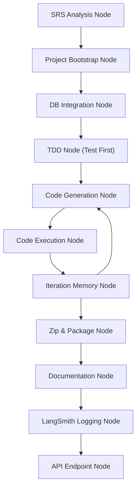

```mermaid
graph TD
  srs_analysis["SRS Analysis Node"]
  project_bootstrap["Project Bootstrap Node"]
  db_integration["DB Integration Node"]
  tdd["TDD Node (Test First)"]
  code_generation["Code Generation Node"]
  code_execution["Code Execution Node"]
  iteration_memory["Iteration Memory Node"]
  zip_packager["Zip & Package Node"]
  documentation["Documentation Node"]
  langsmith_logging["LangSmith Logging Node"]
  api_endpoint["API Endpoint Node"]
  srs_analysis --> project_bootstrap
  project_bootstrap --> db_integration
  db_integration --> tdd
  tdd --> code_generation
  code_generation --> code_execution
  code_execution --> iteration_memory
  iteration_memory --> code_generation
  iteration_memory --> zip_packager
  zip_packager --> documentation
  documentation --> langsmith_logging
  langsmith_logging --> api_endpoint
```
